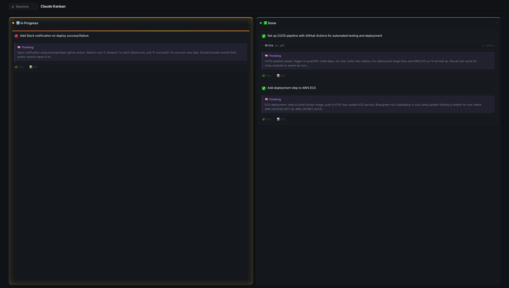
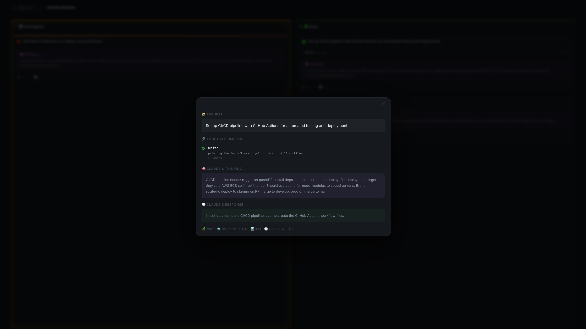

# AI Kanban

A VS Code extension that visualizes [Claude Code](https://claude.ai/code) sessions as a real-time Kanban board.

Parses the JSONL session files Claude Code writes to `~/.claude/projects/`, turns each conversation turn into a Kanban card, and keeps everything in sync as Claude works. A status bar button and Activity Bar panel give you instant access at any time.

## Screenshots

**Kanban Board**



**Task Detail Modal**



## Features

### Kanban Board
- Each conversation turn in a session becomes a card in **In Progress** or **Done**
- The currently active task is highlighted with a live indicator (🔴)
- Cards show a preview of tool calls used, duration, token usage, and Git branch
- Drag and drop cards between columns

### Task Detail Modal
Click any card to open a modal with the full details:
- **User request** — the original prompt
- **Tool call timeline** — each tool's name, inputs, success/error status, and duration
- **Thinking** — full Extended Thinking blocks
- **Response** — full assistant text response
- Model name, Git branch, token count, and start time

### Session Navigation
- Browse sessions from the **Activity Bar** sidebar or the **slide-in drawer** inside the board
- Sessions are grouped by project; projects with a live session are highlighted with a red icon
- Hover over a session to see its project path, Git branch, model, token count, and task count
- Click any session to switch the board to it instantly

### Real-time File Watching
- Watches `~/.claude/projects/**/*.jsonl` for changes using [chokidar](https://github.com/paulmillr/chokidar)
- The board updates immediately when the active session changes

### Live Session Detection
- Sessions updated within the last N minutes (default: 10) are marked as **LIVE**
- Live status is reflected immediately in the sidebar and on cards

### Workspace Filtering
- When a folder is open in VS Code, only sessions from that project are shown
- With no folder open, all sessions across all projects are shown

## Settings

| Setting | Default | Description |
| --- | --- | --- |
| `aiKanban.claudeDir` | `~/.claude` | Path to the session data directory |
| `aiKanban.liveThresholdMinutes` | `10` | Minutes since last update to consider a session live |
| `aiKanban.autoOpenOnLive` | `false` | Auto-open the board when a live session is detected |

## Commands

| Command | Description |
| --- | --- |
| `AI Kanban: Open Board` | Open the Kanban board panel |
| `AI Kanban: Refresh` | Manually refresh the session list |

## Requirements

- VS Code `^1.85.0`
- [Claude Code](https://claude.ai/code) installed and has written at least one session to `~/.claude/projects/`

## Development

No packaged installer (`.vsix`) is currently available. To use the extension, run it in development mode as described below.

```bash
npm install
npm run watch
# then press F5 to launch the Extension Development Host
```
